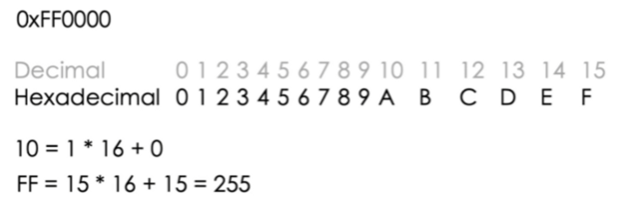

<aside>
💡 The purpose of writing this article is to record my process of learning GLSL and try to describe what I have learned in my own words.
</aside>

## What is a Shader?

In the field of computer graphics, a shader is like a magician that can make our images look better. They were originally used to handle the shading of images, such as calculating lighting, brightness, color, etc., but now their capabilities go beyond that, and they can be used in various different fields, such as processing CG effects, performing video post-processing, and even being useful in fields unrelated to computer graphics.

Using shaders to calculate rendering effects on graphics hardware has a high degree of freedom. Although not mandatory, most shaders are developed for GPUs. The programmable graphics pipeline of GPUs has completely replaced the traditional fixed pipeline, and can be programmed using the shader language. This means that the basic elements that make up the final image, such as pixels, vertices, and textures, their position, hue, saturation, brightness, and contrast, etc., can all be dynamically adjusted through the algorithms in the shader. Moreover, external programs can use the external variables and textures provided by the shader to modify the parameters in the shader.

Shaders are often used to create various effects in fields such as film post-processing, computer imaging, and video games. In addition to ordinary lighting models, shaders can also adjust the hue, saturation, brightness, and contrast of images, and generate effects such as blur, highlights, volumetric light sources, defocus, cartoon rendering, color separation, distortion, bump mapping, chroma key (i.e., blue screen, green screen matting effects), edge detection, etc.

In GLSL, shaders are usually written in the GLSL language. GLSL shaders support many different features, including general algorithms, vector and matrix operations, texture processing, and lighting calculations. Shaders can also use programming structures such as conditional statements, loops, and functions to achieve more complex effects.
## History of Shaders
In May 1988, Pixar released the third edition of the RenderMan specification, promoting the use of "shaders" in various application fields. [[2]](https://zh.wikipedia.org/wiki/%E7%9D%80%E8%89%B2%E5%99%A8#cite_note-2)

With the advancement of graphics processors, major graphics software libraries such as OpenGL and Direct3D began to support shaders. Initially, GPUs that supported shaders only supported pixel shaders, but as developers gradually recognized the power of shaders, vertex shaders soon appeared. In 2000, the first GPU to support programmable pixel shaders, Nvidia GeForce 3 (NV20), was launched. Direct3D 10 and OpenGL 3.2 introduced geometry shaders. In modern computer graphics, programmable shaders have become an indispensable part. They allow developers to create high-quality, highly customizable graphics effects, bringing more realistic visual effects to games, movies, and other applications.
## What are Shaders in WebGL?
Shaders are like a group of painters, responsible for coloring our geometric shapes and making them look good on the screen. They will paint colors and add textures and lighting effects to each vertex and pixel. We provide a lot of data, such as vertex positions, camera information, colors, textures, etc., and then the GPU, according to the instructions of the shader and this data, will make our geometric graphics appear in the best condition in front of us.
## Shader Types
**Vertex Shader (Vertex Shader**)
The vertex shader is the magician that can make your geometric shapes appear on the screen. It will send the position of each vertex, grid transformation, camera information, etc. to the GPU, and then the GPU will follow its instructions to project your shapes into 2D space images on the screen, just like painting on a canvas. His code will be applied to each vertex of the geometry, but some data will change between vertices, which is called **attribute** "attribute", and some data will not change, which is called **uniform** "uniform". After the vertex shader finishes its work, the GPU knows which pixels are visible and can let the fragment shader color them.

> Simply put, the same vertex shader will be used for each vertex, but data like vertex positions will be different for each vertex, and this type of data is called **attribute**.

**Fragment Shader (Fragment Shader**)
The fragment shader is the program that colors each small fragment of the geometric shape, just like painting each small piece of a puzzle with color. It will be used for each visible small fragment, just like each small piece of the puzzle needs to be painted with color. We can throw color and other data directly to it, just like we do with the vertex shader, or we can pass the data from the vertex shader to it. This data passed from the vertex shader to the fragment shader is called **varying** "variable", that is, their values will change with different small fragments.
In short, GLSL is a program that makes our geometric shapes look better and more realistic with the help of painters. If you want to learn more about it, you can check out the reference articles.
> Uniform variables are global variables, and their values remain unchanged throughout the shader program. Uniform variables are usually used to represent material properties, lighting properties, etc. [Can be understood as constants].
>
> Varying variables are variables passed from the vertex shader to the fragment shader. Their values are interpolated between the vertex shader and the fragment shader so that they can be used for color calculations in the fragment shader. Varying variables are usually used to represent vertex attributes, such as vertex colors, texture coordinates, etc.
## Basic Types
- void – Used for functions without a return value
- bool – Conditional type, its value can be true or false
- int – Signed integer
- float – Floating point number
- vec2 – Vector composed of 2 floating-point numbers
- vec3 – Vector composed of 3 floating-point numbers
- vec4 – Vector composed of 4 floating-point numbers
- bvec2 – Vector composed of 2 Booleans
- bvec3 – Vector composed of 3 Booleans
- bvec4 – Vector composed of 4 Booleans
- ivec2 – Vector composed of 2 integers
- ivec3 – Vector composed of 3 integers
- ivec4 – Vector composed of 4 integers
- mat2 – 2x2 matrix of floating-point numbers
- mat3 – 3x3 matrix of floating-point numbers
- mat4 – 4x4 matrix of floating-point numbers
- sampler1D – Handle (or: operation, as a noun) used to access one-dimensional textures
- sampler2D – Handle used to access two-dimensional textures
- sampler3D – Handle used to access three-dimensional textures
- samplerCube – Handle used to access cube map textures
- sampler1Dshadow – Handle used to access one-dimensional depth textures
- sampler2Dshadow – Handle used to access two-dimensional depth textures
## Built-in Common Variables
1. `modelMatrix` (Model Matrix): Represents the matrix that transforms the model from model space to world space. It is usually used to convert the vertex positions of the model from the local coordinate system to the world coordinate system.
2. `viewMatrix` (View Matrix): Represents the matrix that transforms the scene from world space to the observer (camera) space. It is usually used to convert vertices from the world coordinate system to the observer coordinate system.
3. `projectionMatrix` (Projection Matrix): Represents the matrix that transforms the scene from the observer space to the clipping space. It is usually used to perform projection transformations, converting vertices from the observer coordinate system to the clipping space (normalized device coordinate system).
4. `modelViewMatrix` (Model View Matrix): Is a combination of `viewMatrix` and `modelMatrix`. It represents the matrix that transforms the model from model space to the observer space. By first applying the vertex positions of the model to `modelMatrix` and then to `viewMatrix`, they can be converted from the local coordinate system to the observer coordinate system.
## GLSL Color Conversion
### Hexadecimal Conversion to RGB Color

In the context of computer programming, hexadecimal is a base-16 number system that uses numbers 0-9 and letters A-F to represent values. In this case, "0xFF0000" represents red in RGB format, with the first two digits representing the red channel value, the next two digits representing the green channel value, and the last two digits representing the blue channel value.
In the rgba format, the value range of each color channel is from 0 to 255, so we can convert each 2-digit value in the hexadecimal color code to a decimal number and map them to the corresponding red, green, and blue channels.
In this example, the `0x` prefix indicates that the value following it is in hexadecimal format, `FF` converts to a decimal number of 255, so the red channel of this color is 255. The green and blue channels are both 0, because their values in the hexadecimal code are both 00. At the same time, because there is no value for the alpha channel, so A=1.0, the value of the transparency channel is also 255, because it is completely opaque.
Therefore, the RGBA representation of this hexadecimal color is

## 📎 Reference Articles
[Shaders](https://en.wikipedia.org/wiki/Shader)

[The Book Of Shaders](https://thebookofshaders.com/01/)
