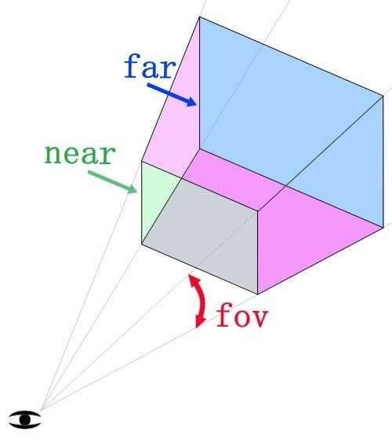
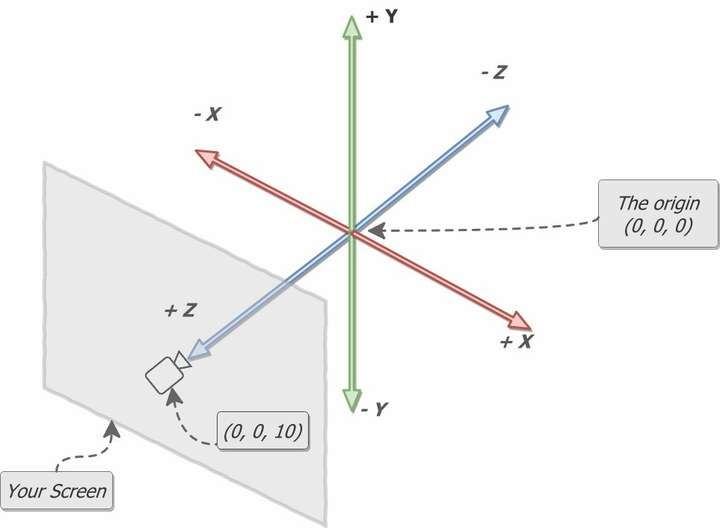
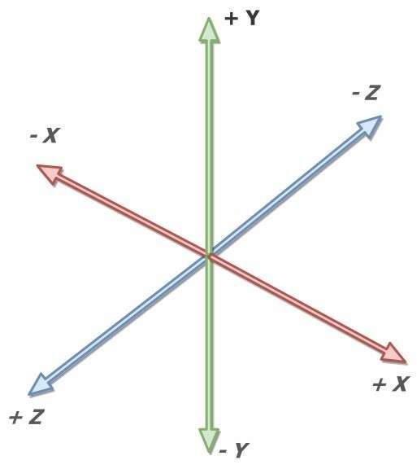

## **What is Three.js**?

Three.js is a 3D JavaScript library that enables you to create 3D experiences on the web with ease. If you want to make your website more eye-catching, Three.js is your ideal companion.

Three.js is a JavaScript library released under the MIT license that runs on top of WebGL. The goal of this library is to simplify the process of handling 3D content. With just a few lines of code, you can obtain an animated 3D scene without needing to understand complex shaders and matrices.

## **What is WebGL**?

WebGL is a JavaScript API that allows you to render triangles in a canvas at high speed, as it utilizes the visitor's graphics processing unit (GPU). The GPU can perform thousands of parallel computations, enabling complex calculations within a 3D scene. However, despite its excellent performance in handling 3D scenes, WebGL still has some drawbacks. For example, if you want to create a complex scene, you need to master some advanced techniques, which can be challenging for beginners. Additionally, WebGL requires high-performance hardware to run, as it consumes significant computing resources. Therefore, if your computer has insufficient performance, using WebGL may cause your application to run slowly or crash.

Native WebGL is very difficult because you need to write a lot of code manually. However, Three.js eliminates this barrier, allowing you to easily create 3D scenes. Apart from Three.js, there are other tools that can help you create 3D scenes more easily, such as Babylon.js and A-Frame. These tools offer a variety of features, ranging from simple scenes to complex virtual reality experiences. Therefore, if you want to create a 3D application, you can consider using these tools to simplify the development process.

## **Four conditions required for Three.js to run**

- Scenes (scenes)
- Renderers (renderers)
- Cameras (cameras)
- Objects (objects)

## **What is a scene**?

In Three.js, a scene is a crucial concept. It is similar to a container or a world that can hold various objects, models, particles, and lights. The scene is a core component in Three.js and is essential for building a 3D scene. By adding different objects to the scene, we can create a complex 3D environment, thereby achieving a more vivid and engaging 3D experience.

## **What is a renderer**?

A renderer is a crucial component that renders our code and design into our web. In Three.js, we typically use the [WebGLRenderer](https://threejs.org/docs/index.html#api/en/renderers/WebGLRenderer) class for rendering. WebGL is a 3D graphics standard that allows us to render complex 3D graphics on the web without the need for plugins, which is fantastic. One of the great things about WebGLRenderer is that it provides rich features, such as support for materials, lights, shadows, and reflections. This enables us to create more realistic scenes and models, thereby enhancing the user experience. In summary, a renderer is an essential part of any 3D scene and is indispensable in Three.js.

## **What are objects**?

In Three.js, all elements are objects, including geometries, models, particles, and lights. These objects can apply different materials and textures and be rendered using cameras and lights. Three.js also provides many extensions and libraries, such as MeshStandardMaterial and dat.gui, which allow you to create more advanced rendering effects and user interfaces.

## **What is a camera**?

In Three.js, the camera is a crucial element that determines the angle and position from which we observe the scene. The camera simulates the human eye's observation of the scene and is therefore very important. Creating a camera in Three.js is very simple. We can use the [PerspectiveCamera](https://threejs.org/docs/index.html#api/en/cameras/PerspectiveCamera) class to create a camera. This class allows us to set many parameters, such as the field of view, aspect ratio, near plane, and far plane, thus giving us full control over the camera's behavior.

Additionally, in Three.js, the camera itself is invisible. It is only used for calculation and determining the position and angle of objects in the scene. Therefore, we can only see the content observed by the camera and not the camera itself. This means that we need to add other visible objects to the scene, such as objects and lights, to see the scene. Therefore, when using Three.js, we not only need to understand the use of the camera but also how to create and operate other types of objects.

> PerspectiveCamera( fov : Number, aspect : Number, near : Number, far : Number )
 fov — Vertical field of view angle of the camera frustum aspect — Aspect ratio of the camera frustum near — Near plane of the camera frustum far — Far plane of the camera frustum

In Three.js, we can have multiple cameras, but usually, only one is needed.

The camera in Three.js is similar to a cone, and it is influenced by the field of view and aspect ratio.

**Field of View**:

The field of view is how large your perspective is. If you use a very large angle, you will be able to see in all directions at the same time, but there will be a lot of distortion because the result will be drawn on a small rectangle. If you use a small angle, the objects will appear magnified.

### **How do we render to a specific location**?

In this case, we need to understand Cartesian coordinates (this is difficult to explain, so we use pictures to explain), and locate in three-dimensional space through x, y, and z coordinates. The orthogonal right-hand coordinate system is used in WebGL and Threejs:

- Orthogonal right-hand coordinate system: The thumb of the right hand represents the X-axis, the index finger represents the Y-axis, and the middle finger represents the Z-axis.
- The arm and thumb represent the Y-axis.
- The Z-axis is parallel to the ground.
- The thumb represents the X-axis.

**Cartesian Coordinate System Diagram**:

## **Conclusion**

The above is a detailed explanation of the Three.js rendering process. Understanding this process is crucial for comprehending how Three.js works. If you want to delve deeper into Three.js, I recommend checking out the official documentation and examples, which contain a wealth of useful information and code snippets to help you better understand and use Three.js. Additionally, you can try creating your own 3D scenes and models, which will help you master the techniques and principles of Three.js. I hope this article is helpful to you, thank you!
