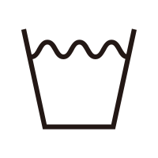
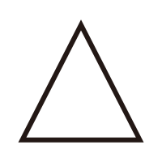
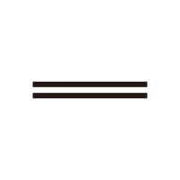
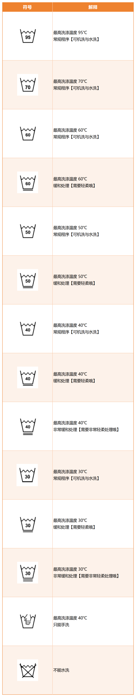

## 前言
我来开新坑喽，这次我们来聊聊生活中的一些事情，我们的衣服，说真的我买了这么多衣服，衣服上的标识我都认识不全，
而且因为不懂衣物标签而把有些衣服洗坏了，借此机会我来好好学习一下衣物标签的含义，希望大家也能够从中受益😄

> 本文主要介绍衣服上的标识含义来源于国家GB/T8685-2008标准

## 标识含义😄

### 洗涤方式
#### 水洗
在我们自己家中用盆、桶或者其他容器洗衣服，脱水也算哦

    

#### 漂白
在我们自己家中用漂白剂漂白衣服，不过嘛不要加多哦，不提了都是泪

    

#### 干燥
在我们自己家中挂在晾衣架上晾干衣服或者用烘干机去除衣服水分的操作

    

#### 熨烫
在我们自己家中用熨斗熨烫衣服，不过嘛不要熨烫过热哦，不然衣服会变形的

    

#### 专业纺织品维护
这个嘛主要是用圆圈表示，有这个符号代表着需要专业干洗或专业湿洗

    

##### 不允许
这个符号就是不允许使用这个方法来维护衣服

    

#### 缓和处理与非常缓和处理
这个符号就是需要在温和的条件下处理，不要用太热的水或者太热的熨斗

    
    

#### 处理温度
这个符号就是需要在多少度的条件下处理一般是与其他符号配套出现一般用**小黑点**表示，点数越多温度越高这里就不放图片表示啦😄

## 完整标识
我们在上方介绍的是基本标识，而完整标识则是将基本标识组合在一起，形成一个完整的标识，这样就能够更好的保护我们的衣服啦

### 水洗

    

### 漂白

### 干燥

### 翻转干燥

### 熨烫
.png>)

### 专业维护

## 后记
到此就是衣服上的标识含义啦，希望大家能够更好的保护自己的衣服😄

