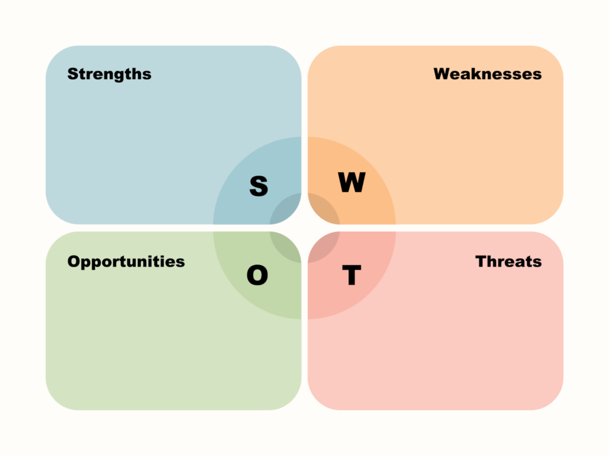

## 前言
在之前的文章中,我们探讨了[SCQA](https://betterthantomorrow.top/zh-cn/p/think004/)使用这个方法来将复杂的问题清晰化，这次我们来看新的方法论SWOT分析法。

在开始介绍之前，我还是想在重复一下那句话，独立思考是一种能力，而方法论是一种工具。熟练使用工具，能帮助我们理清复杂问题，找到更有针对性的解决方案，希望大家和我一起能通过实践收获新知。

## 为什么选择SWOT分析法？

与SCQA类似，SWOT主要是由四个要素组成，分别是：
- Strengths（优势）
- Weaknesses（劣势）
- Opportunities（机会）
- Threats（威胁）

通过这个方法无论是个人职业规划、公司战略制定，还是项目风险评估，SWOT分析法都能提供清晰的逻辑框架。

## 如何使用SWOT分析法？
以个人举例让我们看下面的例子：
销售经理案例背景：作为一家互联网公司的销售经理为了更好地规划个人职业路径，他借助SWOT分析法理清现状：
- Strengths（优势）：我有丰富的销售经验，擅长客户沟通。
- Weaknesses（劣势）：我对市场变化的敏感度不够，缺乏团队管理经验。
- Opportunities（机会）：公司业务拓展迅速，需要大量销售人员。
- Threats（威胁）：市场竞争激烈，新兴公司崛起。

在让我们看另外一个例子这次我们以公司为例：
公司A是一家新创公司，我们可以用SWOT分析法来分析公司A的发展：
- Strengths（优势）：公司A有技术优势，团队年轻有活力。
- Weaknesses（劣势）：公司A缺乏市场经验，资金短缺。
- Opportunities（机会）：市场需求旺盛，政策支持力度大。
- Threats（威胁）：市场竞争激烈，行业监管政策不明朗。

通过上述的例子我们可以看到，SWOT分析法可以帮助我们全面了解问题的内外部环境，帮助我们更好地制定战略，提高决策的准确性。
相对于SCQA来说，SWOT更注重对内外部环境的全面分析，而SCQA偏向于问题逻辑的梳理。

## 扩展

通过这些方法论我们可以快速的解决现有发生的问题同时辅助决策，但是更为重要的是，在制定好方案或战略需要快速的执行，因为只有执行才能让我们的想法变为现实，所以希望大家在实践的过程中多多思考，多多实践，让我们的想法变为现实！

