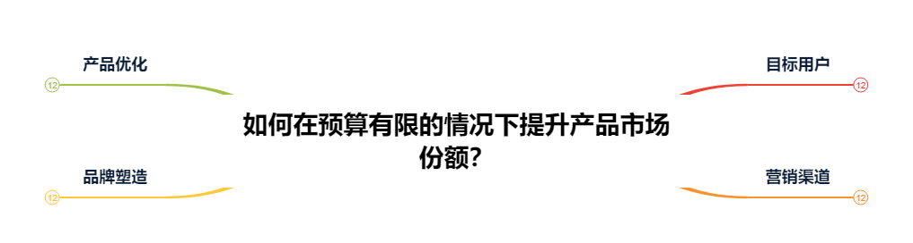
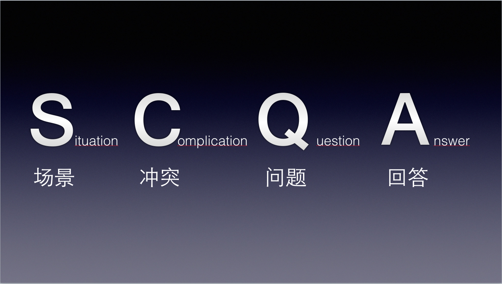
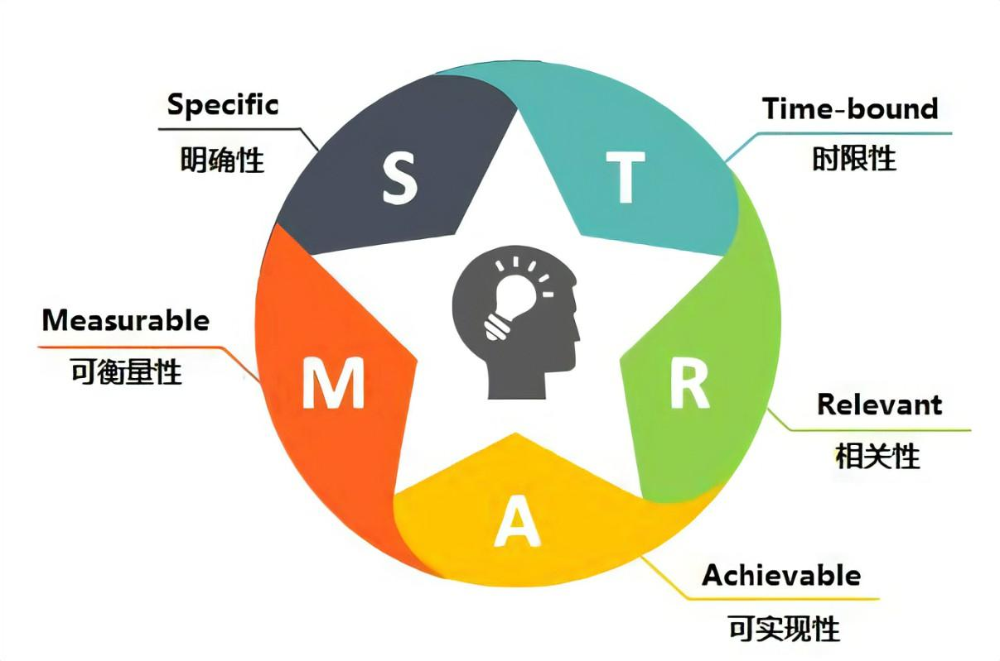
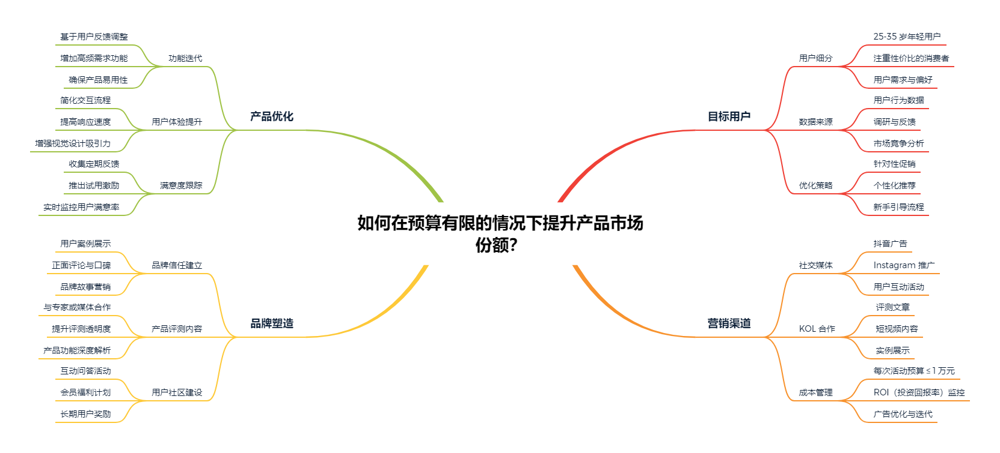

## 前言
在之前的文章中,我们探讨了[SWOT分析法](https://betterthantomorrow.top/zh-cn/p/think005/)来分析内外部环境，这次我们来看新的方法论MECE法则。

同样的在开始之前，我还是想在重复一下那句话，独立思考是一种能力，而方法论是一种工具。熟练使用工具，能帮助我们理清复杂问题，找到更有针对性的解决方案，希望大家和我一起能通过实践收获新知。

## 什么是MECE法则？

MECE的全称是Mutually Exclusive Collectively Exhaustive，即互斥且完全穷尽。这个方法论最早是由麦肯锡公司提出的，用于解决复杂问题，确保问题的全面性和逻辑性。

核心思想：将问题拆分为 **互斥且完全穷尽** 的子问题。具体来说：
- **相互独立**：子问题之间没有重叠，避免重复工作。
- **完全穷尽**：所有子问题的组合可以完全覆盖原问题，避免遗漏关键因素。

通过这种结构化的方法，我们可以更清晰地看待问题，找到针对性的解决方案。

## 如何使用MECE法则？

然我们来假设一个场景，公司A是一家新创公司，公司希望提升用户的留存率，我们可以通过MECE法则来分析问题：

### Step 1: 明确问题
首先，确定你想解决的核心问题。比如，公司A希望提升用户留存率。

### Step 2: 拆分问题
利用MECE法则，将问题分解为互斥且完全穷尽的子问题：
- **用户层面**：哪些用户群体的留存率较低？
- **产品层面**：产品功能是否满足用户需求？
- **运营层面**：营销活动是否吸引用户长期参与？

### Step 3: 分析每个子问题
针对每个子问题，深入挖掘其核心原因。例如：
1. 用户层面：通过用户数据分析，识别不同用户群体的留存表现。
2. 产品层面：收集用户反馈，评估功能使用率与满意度。
3. 运营层面：回顾以往活动，分析用户参与率及其后续行为。

### Step 4: 整合结论并制定行动计划
根据每个子问题的分析结果，制定针对性的改进措施：
- 优化用户体验：为低留存率群体设计专属引导流程。
- 增强功能价值：推出满足用户需求的新功能。
- 提升运营效率：定期推出高粘性的互动活动。

## MECE法则的实际应用场景

1. **职业规划**：当你为未来感到迷茫时，可以从兴趣、能力、市场需求等角度入手，构建一个MECE框架。
2. **项目管理**：在项目启动前，用MECE法则梳理需求，确保方案覆盖所有关键点。
3. **生活决策**：面对多项选择（如买房、留学），用MECE法则分类和筛选信息，快速找到最优解。

## MECE 与其他方法论的比较

在面对复杂问题时，单一的方法论有时难以全面应对。因此，我们需要根据问题的性质选择合适的工具。以下是 MECE 与其他常见方法论的对比及其适用场景分析：

### MECE 法则

**核心特点**：逻辑性强，强调分类的“相互独立，完全穷尽”。  
**适用场景**：
- 复杂问题的拆解与梳理（如制定战略、优化流程）。  
- 需要系统化分析，确保全面性的场景。  
**优点**：
- 提供清晰的逻辑框架，便于深入思考和分析。  
- 避免遗漏关键点，也避免冗余。  
**局限**：
- 适用逻辑思维强的场景，但对情感或主观问题的分析支持有限。  

---

### SWOT 分析

**核心特点**：通过内外部分析（优势、劣势、机会、威胁）明确现状和方向。  
**适用场景**：
- 制定战略时，用于分析外部环境和内部资源（如企业发展规划）。  
- 简单直观的分析场景（如个人职业规划）。  
**优点**：
- 易于理解，适合初学者使用。  
- 结合外部环境和内部因素，有助于识别机会和风险。  
**局限**：
- 结果可能偏主观，缺乏系统化的逻辑。  
- 无法直接生成行动计划，需要进一步细化。  

---

### SCQA 框架

**核心特点**：通过情境（Situation）、冲突（Complication）、问题（Question）、答案（Answer）构建清晰的叙述框架。  
**适用场景**：
- 需要快速表达观点、提出问题或讲述逻辑（如工作汇报、商业提案）。  
- 用于说服场景，尤其是需要简洁有力的表达时。  
**优点**：
- 聚焦于关键冲突，逻辑清晰且具有说服力。  
- 更适合叙述问题和解决方案的场景。  
**局限**：
- 不适用于深入分析，更多是呈现逻辑和结论的工具。  

---

### SMART 原则

**核心特点**：以具体（Specific）、可测量（Measurable）、可实现（Achievable）、相关性（Relevant）、有时限（Time-bound）为标准设置目标。  
**适用场景**：
- 目标设定与管理（如团队目标制定、个人计划管理）。  
- 需要执行性强、结果导向的场景。  
**优点**：
- 强调目标的具体性与可操作性，有助于提高执行效率。  
- 易于衡量成果，便于跟踪进度。  
**局限**：
- 过于聚焦短期目标，可能忽略长期愿景。  
- 不适合问题分析或逻辑推导的场景。  

---

## 方法论的选择与组合

在实际工作中，单一方法论往往无法解决所有问题，结合使用不同方法论能达到更好的效果。例如：  
1. **战略制定**：先用 SWOT 分析内外部环境，再用 MECE 法则拆解关键问题，最后用 SMART 原则设定具体目标。  
2. **商业提案**：通过 SCQA 框架阐述问题与方案，再用 MECE 确保分析的全面性与逻辑性。  
3. **个人发展规划**：用 SWOT 明确现状与目标方向，用 SMART 细化行动计划。

## 方法论结合的例子

场景：一家初创公司希望提升产品市场份额

### Step 1: 用 SWOT 分析公司现状
我们先分析公司的内外部环境，明确当前的优劣势及机会与威胁。

**SWOT 分析结果**：

- **优势 (Strengths)**：  
  - 产品技术领先，具有独特功能。  
  - 团队年轻且充满活力，适应市场变化快。  

- **劣势 (Weaknesses)**：  
  - 品牌知名度较低，缺乏用户信任。  
  - 市场营销经验不足，预算有限。  

- **机会 (Opportunities)**：  
  - 市场需求增长，目标用户数量增加。  
  - 社交媒体平台提供了低成本宣传机会。  

- **威胁 (Threats)**：  
  - 竞争对手产品更成熟，且已有稳定用户群。  
  - 行业法规可能导致未来的产品合规性风险。  

---

### Step 2: 用 SCQA 框架明确关键问题和目标
通过 **SCQA 框架**，清晰表达背景、问题和解决方案：  

- **情境 (Situation)**：市场需求旺盛，公司产品技术领先，但用户渗透率低。  
- **冲突 (Complication)**：资源有限且竞争激烈，品牌认知度低，难以快速扩大用户群。  
- **问题 (Question)**：如何在预算有限的情况下，通过有效策略吸引核心用户、提升品牌影响力，实现市场份额增长？  
- **答案 (Answer)**：制定低成本营销策略，聚焦核心用户群，提升品牌影响力，优化用户体验。  

---

### Step 3: 用 MECE 法则拆解问题
按照 **MECE 法则**，将问题分解为互斥且完全穷尽的子问题：

1. **目标用户**：哪些用户群体是我们的核心市场？  
2. **营销渠道**：哪些渠道可以以最低成本接触最多用户？  
3. **品牌塑造**：如何提升品牌知名度并增强用户信任？  
4. **产品优化**：如何优化现有产品以提高用户满意度？  

---

### Step 4: 用 SMART 原则设定目标
根据两种 **SMART 原则**，为每个子问题设定目标并执行行动计划：

---

#### 1. **基于 STAR 框架的 SMART 设定**

**S - 情境 (Situation)**  
公司是一家初创企业，技术产品具有独特优势，但因品牌知名度不足，用户留存率较低，市场份额未达预期。

**T - 任务 (Task)**  
通过低成本的营销策略，在 3 个月内提升品牌知名度和核心用户留存率，实现市场份额增长 8%。

**A - 行动 (Action)**  
- **目标用户定位**：分析用户行为数据，锁定 25-35 岁注重性价比的年轻用户群体，并调整营销策略。  
- **社交媒体推广**：设计 5 次低成本广告活动，与 KOL 合作发布产品评测内容，强化品牌信任感。  
- **功能优化与用户激励**：基于用户反馈，在两周内上线高需求功能，并推出会员折扣活动。

**R - 结果 (Result)**  
- 新增核心用户 12,000 名，超额完成目标（10,000 名）。  
- 广告覆盖量达到 150 万次，转化率提高 20%。  
- 产品市场份额增长 8%，并新增两家战略合作伙伴。

---

#### 2. **基于 Specific, Measurable, Achievable, Relevant, Time-bound 的 SMART 设定**
- **Specific（具体）**：通过社交媒体广告和用户反馈优化活动，在 3 个月内吸引核心用户群并提升品牌知名度。  
- **Measurable（可测量）**：新增用户 10,000 名，广告覆盖量 100 万次，活动转化率 15%。  
- **Achievable（可实现）**：以过往数据和预算为基础，目标设定合理可行。  
- **Relevant（相关性）**：该目标支持公司战略，直接提升市场份额和品牌影响力。  
- **Time-bound（有时限）**：完成目标的时间为 3 个月，并在每月评估进展。

## 尾声
我举这个例子是希望告诉自己也告诉大家，<strong>方法论是一种工具</strong>,不要被工具框死了自己的思维适用自己有效果就好，而是要灵活运用，结合实际情况，找到最适合自己的解决方案。

